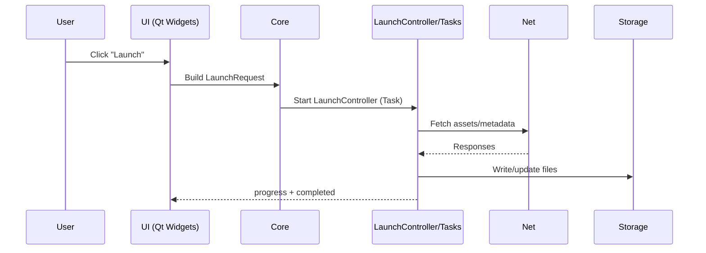

# Architecture Overview (Detailed)

## Scope and goals

This document is a map of the launcher at the module level. It focuses on boundaries, interactions, and the main data flows so you can find the right files quickly before making changes.

## Layered model

1. **UI + ViewModels** (`launcher/ui/`, `launcher/viewmodels/`)
   - Qt Widgets screens, dialogs, and widgets.
   - ViewModels expose state and actions for the UI.

2. **Core/domain** (`launcher/`, `launcher/minecraft/`, `launcher/java/`)
   - Models, settings, instance management, launch logic.
   - No UI dependencies.

3. **Task system** (`launcher/tasks/`)
   - Long-running or async work (downloads, extraction, indexing).
   - Emits progress and completion signals.

4. **Networking** (`launcher/net/`)
   - HTTP requests and API adapters.
   - Used by tasks and core services.

5. **Mod platform integrations** (`launcher/modplatform/`)
   - Mod platform APIs and install flows.
   - Orchestrated by tasks and core logic.

## Where to start in code

- `launcher/main.cpp`: entry point, application wiring.
- `launcher/Application.cpp`: lifecycle, settings, instance loading.
- `launcher/ui/MainWindow.cpp`: main Qt Widgets UI.
- `launcher/LaunchController.cpp`: launch orchestration (Task).
- `launcher/tasks/`: long-running work and progress reporting.

## Component catalog

| Component | Path | Responsibility | Depends on |
| --- | --- | --- | --- |
| UI | `launcher/ui/` | Render UI, collect input, start actions | Core, Tasks |
| ViewModels | `launcher/viewmodels/` | Present core data to the UI | Core |
| Core/Domain | `launcher/`, `launcher/minecraft/` | Domain models and launch logic | Storage, Tasks, Net |
| Tasks | `launcher/tasks/` | Async work and progress reporting | Net, Storage |
| Net | `launcher/net/` | HTTP/APIs, downloads | External APIs |
| Modplatform | `launcher/modplatform/` | Mod platform workflows | Net, Tasks |
| Java | `launcher/java/` | Java discovery/metadata | Storage |

## High-level control flow

### Startup

1. `main.cpp` initializes the `Application` singleton.
2. `Application` loads settings, accounts, and instances.
3. UI is created (`MainWindow`), which binds to application state.

### Launch flow (typical)



## Data flow diagram

```mermaid
graph TD
  UI[UI (Qt Widgets)] -->|signals/slots| ViewModels
  ViewModels --> Core
  UI --> Tasks
  Core --> Storage[(Disk: settings/instances/cache)]
  Tasks --> Net
  Tasks --> Storage
  Net --> ExternalAPIs[(Remote APIs)]
  Modplatform --> Net
```

## Module boundaries and rules

- UI must not perform long-running work or file/network I/O.
- Core and tasks must not depend on Qt Widgets.
- ViewModels should stay free of UI widget dependencies.
- Use `Task` for work that blocks or takes more than a few milliseconds.
- Keep dependencies flowing "downward": `ui` -> `core` -> `data` (storage/net).

## Internal contracts (templates)

Use these templates when documenting module interfaces in feature-specific docs.

### Task contract

```cpp
class ExampleTask : public Task {
    Q_OBJECT
protected:
    void executeTask() override {
        setStatus("Working...");
        setProgress(0);

        // Work goes here...
        if (failed) {
            emitFailed("reason");
            return;
        }

        emitSucceeded();
    }
};
```

### Service contract (UI to Core)

```cpp
struct LaunchRequest {
    QString instanceId;
    QString javaPath;
    QMap<QString, QString> env;
};

struct LaunchResult {
    bool ok;
    QString errorCode;
    QString message;
};

class ILaunchService : public QObject {
    Q_OBJECT
public:
    virtual Task::Ptr launch(const LaunchRequest& req) = 0;
signals:
    void progress(int percent);
    void finished(const LaunchResult& result);
};
```

## API contract table (example format)

| Contract | Producer | Consumer | Request | Response/Event | Errors | Notes |
| --- | --- | --- | --- | --- | --- | --- |
| LaunchTask | Core | Task System | `LaunchRequest` | `progress`, `finished` | `failed(code,msg)` | Async |
| DownloadAsset | Task | Net | URL + headers | bytes + status | network errors | Retry policy |

## How to update this document

1. Identify the feature or module (`launcher/<module>/`).
2. List the public interfaces it exposes (signals, task APIs, service methods).
3. Add or update the relevant diagram(s) and contract table entries.
4. Verify control flow against entry points in `main.cpp`, `Application`, and `MainWindow`.

## Notes

- Diagrams are high-level and may omit file-level details.
- Contracts are templates; validate names and arguments against the current code.
